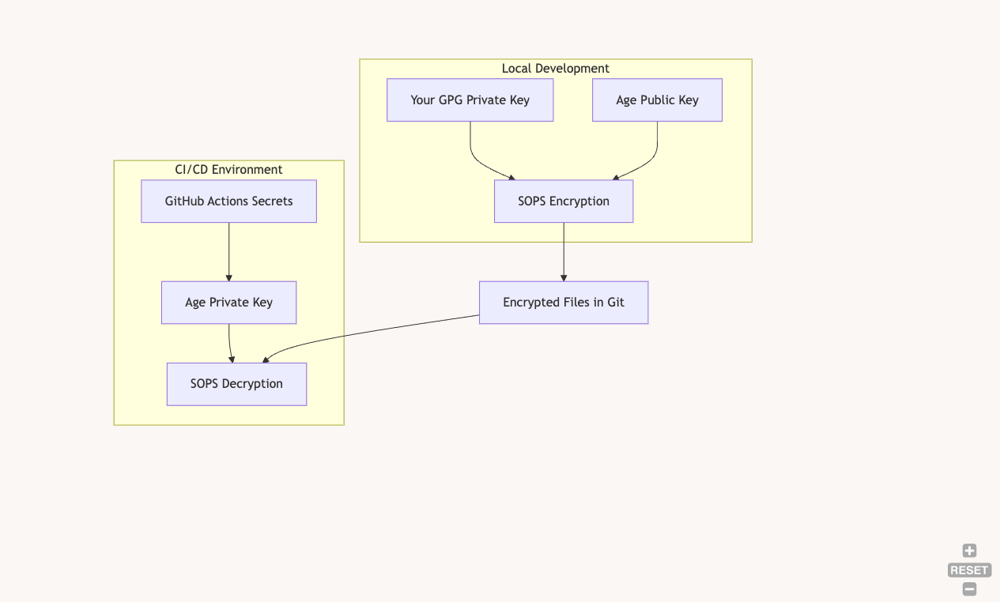

[Image: Using Age Keys (Recommended for CI/CD)](https://mermaid.live/edit#pako:eNptUE1vgkAQ_SubOaMFBBQOTVSUNm1SEnppwcMKo24Cu2RhTanxv3cV-xHrnObjvTdv5gC5KBAC2Epa78hrmHGio1HrvpHBs8hpSULcYynqCnmbQY85xTR9E0qSKI5ILNmetkiesFuRweCezNLkJU7Igueyq1sm-OqXN0-nWySxWpcs_8PoAciLPvnnZf54Nw-14p5Jwa-9hL3mtY1FbyPEGzaWacTaB7Um0_w0aUiiUdg2PTO8aWd2nkXp5S4syJKV2BDGiRa7iEf96oyDARXKirJC__hwGmbQ7rDCDAKdFrihqjyfcdRQqlqRdDyHoJUKDZBCbXcQbGjZ6ErVhb4sZFS_o_rp1pS_C1F9U3QJwQE-ILBG3tCauBPfNm3Pt1zbMaCDwHOHvueYnmVNTMfznfHRgM-zgDn0XFPjx5br2-ORbY6OXzKRoco)


### 2. Example GH Action

Here's the recommended setup using Age keys:
```
# .sops.yaml
creation_rules:
- path_regex: secrets/.*\.yaml$
# Your GPG key for local development
pgp: '00A2FF29586284AF5F09090D790886510CB796C9'
# Age public key for CI/CD
age: 'age1xxxxxxxxxxxxxxxxxxxxxxxxxxxxxxxxxxxxxxxxxxxxxxxx'
```


```yml
# .github/workflows/deploy.yml
name: Deploy
on:
  push:
    branches: [main]

jobs:
  deploy:
    runs-on: ubuntu-latest
    steps:
      - uses: actions/checkout@v2

      - name: Create .sops.keys directory
        run: mkdir -p ~/.sops.keys

      - name: Install sops
        run: |
          wget -O /usr/local/bin/sops https://github.com/mozilla/sops/releases/download/v3.7.3/sops-v3.7.3.linux.amd64
          chmod +x /usr/local/bin/sops

      - name: Setup Age key
        run: echo "${{ secrets.SOPS_AGE_KEY }}" > ~/.sops.keys/key.txt

      - name: Decrypt secrets
        env:
          SOPS_AGE_KEY_FILE: ~/.sops.keys/key.txt
        run: |
          sops --decrypt secrets/prod.enc.yaml > secrets/prod.yaml

```

### 2. Setup

1. Generate Age Key Pair
```bash
# Install age
brew install age  # on Mac
apt install age   # on Ubuntu

# Generate key pair
age-keygen -o key.txt

# The output will show:
# Public key: age1xxxxxxxxxx
# Private key: AGE-SECRET-KEY-1xxxxx

```

2. Add Age public key to .sops.yaml
3. Store Age private key in GitHub Secrets as SOPS_AGE_KEY
